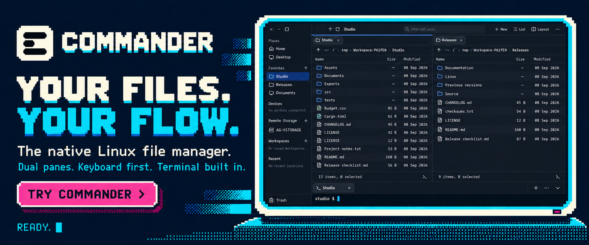
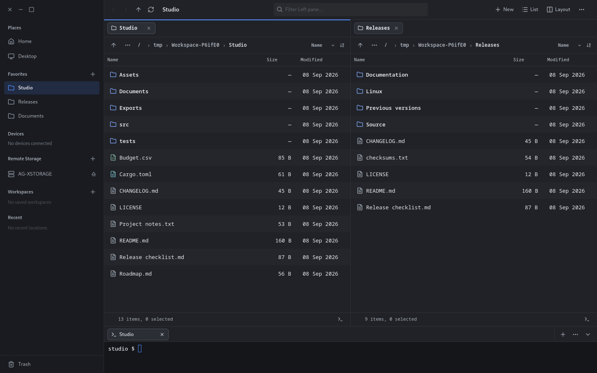

[](#get-started)

# Commander

**Keep your files, tools, and terminal within reach.**

Commander is a native, keyboard-first file manager for Linux. Work across two
folders, preview what you need, and open a terminal right where you are. From
organizing a project to comparing a backup, Commander brings the next step into
view.

[Get started](#get-started) · [Explore the features](#made-for-everyday-file-work) · [Read the guide](docs/REFERENCE.md) · [Report an issue](https://github.com/aheinze/Commander/issues)



## Made for everyday file work

### Two panes. A clear view of both sides.

Keep source and destination side by side when copying, moving, or comparing files.
Choose List, Grid, or Columns to suit the task, open folders in tabs, and save
workspaces for the projects you return to. Column browsing keeps the path through
nested folders visible as you explore.

### Keep your hands on the keyboard

Type to filter a folder, use the command palette to find an action, and work through
selections with familiar shortcuts. Choose the Classic or Modern keymap, then make
it your own in Settings with searchable commands, shortcut capture, and conflict
handling. Search names, paths, and file contents beyond the current folder, then
select results to copy, move, rename, or trash them directly. Open results or reveal
them in their containing folders.

### Bring the terminal to your files

Click the console icon at the right of a file panel's status bar to open a terminal
in that folder. The embedded terminal supports multiple sessions, so you can keep a
shell alongside each task. Hiding the terminal panel keeps those sessions running.

### See what is inside before opening it

Use the inspector or press Space for Quick Look. Preview images, PDFs, and source
files with syntax highlighting that follows your theme. Folder sizes and Git
information help you understand a directory, while live updates keep listings and
previews in step with changes from other applications.
Markdown documents render with headings, lists, tables, code blocks, links, and
local images, so READMEs and project notes are ready to read.
Read PDFs with continuous scrolling, page jumps, document bookmarks, and zoom that
keeps your place. Fit-to-width follows the panel size, and pages render in the
background as you browse.

### Know what your file operations are doing

Track transfers in the activity strip, pause or cancel work, and inspect or retry
failed jobs. Regular-file copies are verified before publication, and folder
synchronization presents its planned changes for review before you apply them.
Undo history and recovery records help you inspect and recover previous work.
See the [operation guarantees and limits](docs/REFERENCE.md#file-operation-guarantees-and-limits)
for the details of cancellation, retained originals, and recovery.

### Make the workspace yours

Choose light or dark appearance, color themes, and the panels you want in view.
Restore your tabs on startup, organize Favorites, and control recent-location
history. Add custom context-menu tools for the commands you use repeatedly.
Settings also includes an About page with version information, release notes,
update checks, verified downloads from signed releases, and copyable details for
troubleshooting.

Preview batch renames before applying them, find duplicate files by content, compare
files side by side, and manage archive contents directly in your file panels. There is more
built in: archive browsing, creation and extraction, password-protected ZIP and 7z
archives, SHA-256 checksums, image conversion, PDF tools, and file tags. Reach
network folders through GVfs-backed connections such as SFTP, SMB, FTP, and WebDAV, with the
corresponding GVfs backends installed.

## Get started

Commander targets Linux, with Wayland and GNOME as its primary desktop environment.
It is under active development.

### Packages

Check [GitHub Releases](https://github.com/aheinze/Commander/releases) for available
builds. The release workflow produces `.deb`, `.rpm`, Arch Linux packages, and
AppImage files for x86_64 and ARM64. See the
[packaging guide](packaging/README.md) for compatibility, checksums, and building
packages yourself.

### Run from source

Install Rust through rustup, a C compiler/linker, `pkg-config`, and the development
packages for GTK 4.14+, libadwaita 1.5+, and GLib 2.80+. The repository pins its Rust
toolchain. GLib's `glib-compile-resources` must be available when building.

On Ubuntu 24.04, the native build dependencies are:

```sh
sudo apt install build-essential pkg-config libgtk-4-dev libadwaita-1-dev libglib2.0-bin
```

Then clone and launch:

```sh
git clone https://github.com/aheinze/Commander.git
cd Commander
./dev.sh --release
```

Open two specific folders with:

```sh
./dev.sh --release -- --left /path/to/project --right /path/to/backup
```

## A few shortcuts to get you moving

These are the default Classic bindings. Open Settings with **Ctrl+,** to customize
them, or press **F1** for the searchable shortcut reference.

| Action | Shortcut |
| --- | --- |
| Switch file panes | Tab |
| Find a command | Ctrl+Shift+P |
| Filter the current folder | Ctrl+F |
| Search file contents | Ctrl+Shift+F |
| Preview a file | Space |
| Rename | F2 |
| Copy / move to the other pane | F5 / F6 |
| Create a folder | F7 |
| Undo | Ctrl+Z |
| Compare folders | Ctrl+Shift+D |

## Go further

- [User and developer reference](docs/REFERENCE.md) — navigation, settings, previews, terminals, and workspace structure.
- [File-operation behavior](docs/REFERENCE.md#file-operation-guarantees-and-limits) — verification, undo, cancellation, and recovery.
- [Release checks](docs/RELEASE_CHECKS.md) — native interaction tests, performance checks, and remote integration.
- [Packaging guide](packaging/README.md) — build, verify, and distribute Linux packages.

## Build with us

Commander is written in Rust with GTK4, libadwaita, and Relm4. Bug reports, workflow
feedback, and contributions are welcome. [Open an issue](https://github.com/aheinze/Commander/issues)
with what you were trying to do and what happened; the About page's **Copy details**
button provides version and runtime information.

For a development build, run `./dev.sh`. Before submitting code, run:

```sh
cargo fmt --all --check
cargo clippy --workspace --all-targets --locked -- -D warnings
cargo test --workspace --locked
```

Run `python3 scripts/test-native.py --backend wayland` for isolated native UI checks.
Further commands and performance fixtures are in the
[developer reference](docs/REFERENCE.md#developer-commands).

Commander is available under the [MIT license](LICENSE). Bundled Lucide icons carry
[ISC and MIT notices](crates/app/assets/icons/LICENSE).
