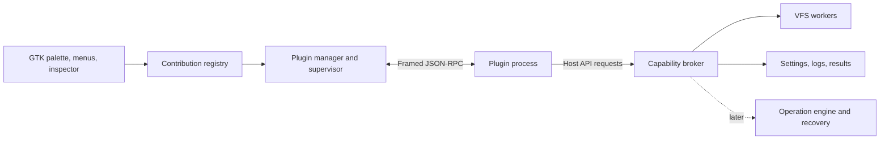

# Commander plugin system plan

Status: Proposed. Based on Commander 0.4.0 at commit `309c89d`, inspected on
2026-09-08. This document plans implementation; it does not add a plugin runtime.

Introduce plugins through a versioned, language-independent protocol and supervised
child processes. Start with commands and file previews installed locally. Commander
owns the GTK interface, command context, and any file operations exposed through the
host API. The initial runtime supports trusted code: process separation contains
ordinary plugin crashes, but does not restrict a native executable's OS permissions.

The proposed scope assumes the first users are installing plugins they trust. If
running untrusted community plugins is a launch requirement, move the sandbox
milestone ahead of the first public release.

## Existing architecture and integration points

| Current code | Implication for plugins |
| --- | --- |
| `crates/app/src/commands.rs` has a closed `CommandId`, static `COMMANDS`, and keymaps keyed by that enum. | Add a dynamic command registry with stable plugin IDs while retaining built-in dispatch. |
| `crates/app/src/app.rs` builds palette items for built-ins and custom tools; `app/context_menu/menu.rs` also exposes tools. | Share contribution discovery and eligibility across palette, menus, and shortcuts. |
| `crates/app/src/session.rs` stores `CustomToolSession`; `app/custom_tools.rs` manages it; `app/util.rs` launches external tools. | Keep saved tools compatible and adapt them to the registry. Their existing launch-only semantics are distinct from supervised plugin requests. |
| `crates/thumbs/src/lib.rs` selects previews in `load_preview`; `app/model_inspector.rs` runs workers with generation checks. | Add provider selection and preserve cancellation, stale-result rejection, and bounded output. |
| `crates/core/src/path.rs` wraps `PathBuf` and serializes native Unix bytes. ADR-0001 requires lossless names. | Define explicit wire paths and opaque file references; display labels must never become operation paths. |
| `crates/vfs/src/lib.rs` exposes synchronous `Vfs` operations and seekable stream interfaces. | Use worker adapters. A remote plugin cannot be implemented merely by registering a URI string. |
| `crates/engine` implements jobs, conflict handling, verified transfers, and recovery journals. | Later host-mediated mutation APIs must use these paths and preserve their documented limits. |
| `dualpane-platform` owns platform-specific code and audited `unsafe`. | Put process-group cleanup and future OS confinement there; keep protocol and registry crates GTK-free. |

## Runtime and API design

Use one supervised process per active plugin, started lazily by a command or matching
preview request. Plugins may be compiled executables or explicitly configured
interpreter/script pairs. A Rust SDK is the supported starting point; a small Python
example should prove that the protocol does not depend on the Rust SDK.

Use JSON-RPC 2.0 for requests, responses, and notifications, with Commander-defined
length framing on stdin/stdout and capped stderr logging. JSON-RPC leaves transport
details to the implementation, so framing, cancellation, streaming, and limits must
be specified separately. [JSON-RPC specification](https://www.jsonrpc.org/specification).

Avoid exposing Rust trait objects or GTK pointers across the plugin boundary. Rust's
native ABI has no stability guarantees, and the current release profile uses
`panic = "abort"`. A process protocol also gives Commander a place to enforce request
deadlines and recover from plugin exits.
[Rust ABI reference](https://doc.rust-lang.org/nightly/reference/items/external-blocks.html).



Proposed ownership:

- `crates/plugin-api`: manifest and wire DTOs, version rules, error codes, protocol
  fixtures; no GTK, runtime, or dependence on app-private types.
- `crates/plugins`: discovery, installation, registry, transport, lifecycle,
  request tracking, logging, and the host-service interface.
- `crates/plugin-sdk`: author helpers for dispatch, cancellation, progress, and
  structured results; no dependency on Commander internals.
- `crates/app/src/app/plugins/`: adapters to Relm4, selection context, preferences,
  previews, and later operation jobs.
- `crates/platform`: native process and confinement helpers where needed.

Version the manifest schema, host API, and plugin package independently. Negotiate a
shared API major/minor at startup; reject incompatible majors before activation.
Minor releases may add optional fields and advertised methods. Unknown required
capabilities fail explicitly. Reject duplicate plugin/contribution IDs and reserve
the built-in namespace. A plugin update cannot silently replace a built-in command.

An illustrative manifest, to be finalized in milestone 1:

```toml
schema_version = 1
id = "org.example.blake3"
name = "BLAKE3 checksum"
version = "0.1.0"
api = ">=1.0, <2.0"
runtime = "process"
entrypoint = "bin/checksum-plugin"
platforms = ["linux-x86_64"]
host_capabilities = ["selection.read", "files.read-selected", "ui.results"]

[[commands]]
id = "checksum"
title = "Compute BLAKE3 checksum"
surfaces = ["palette", "context-menu"]
selection = "one-or-more-files"
```

The full command key is `org.example.blake3/checksum`. Activation rules are derived
from declared contributions; discovery reads manifests without executing code.
Eligibility uses a small declarative set of file-kind, extension, and selection-count
conditions. Do not evaluate plugin code or arbitrary expressions when opening a menu.

The initial contract includes `initialize`, command execution, preview generation,
cancellation, progress, result delivery, and shutdown. Host calls cover a captured
selection, bounded file reads, plugin-specific settings/storage, and native result
presentation. Settings support a small declarative schema; arbitrary UI code and
secret storage are outside the first API.

Capture source pane, effective current directory, focused item, selection, opposite
pane destination, and invocation ID before dispatch. Resolve context-menu targets
explicitly and reuse existing Miller-column selection/current-directory behavior.
Paginate large selections. Use invocation-scoped file references resolved by the
host, with a tagged native-byte representation when a wire path is necessary.
Opaque references must not be forgeable by guessing another plugin's identifiers.
Revalidate identity and destination before any later mutating action.

## Implementation milestones

| Milestone | Deliverable | Completion condition |
| --- | --- | --- |
| 1. Contract and prototype | Write a proposed ADR, manifest schema, protocol fixtures, and a headless host/plugin handshake. Measure startup, cancellation, and transport costs on the supported Linux baseline. | A separately built plugin negotiates its API and returns a result; incompatible versions and malformed messages fail clearly. |
| 2. Contribution registry | Introduce a command reference such as `Builtin(CommandId)` / `Plugin(PluginCommandId)`, registry snapshots, owned labels, shared eligibility, and keymap lookup. Adapt existing custom tools without rewriting their persisted format. | Plugin descriptors appear in palette, context menus, and configurable shortcuts; built-in IDs, keymaps, and saved custom tools retain their behavior. |
| 3. Supervised runtime | Implement manifest discovery, lazy startup, invocation tracking, capability checks, bounded queues/logs, deadlines, cancellation, shutdown, and failure state. | A crashing, hanging, or flooding fixture is stopped without blocking GTK; other plugins and built-in commands remain usable. |
| 4. Command SDK and first plugin | Connect the broker to captured context and VFS reads; implement progress and native text results. Ship a BLAKE3 example and a minimal Python protocol example. | The plugin works on a multi-selection in List, Grid, and Columns, including invalid UTF-8 filenames, and installs without rebuilding Commander. |
| 5. Preview providers | Introduce a provider abstraction around built-in previews, then a plugin adapter and a CSV-summary example. Reuse inspector and Quick Look rendering. | Changing focus cancels obsolete requests; plugin errors fall back to built-ins; output is bounded and cannot overwrite a newer preview. |
| 6. Management and release | Add local package install, enable/disable, removal, diagnostics, permissions/trust display, schema-driven settings, rollback, safe mode, and SDK documentation. Extend package and native release checks. | A plugin completes install → enable → use → update → rollback → disable → remove on supported native/AppImage packages; existing sessions load. |

Milestones 1–6 form the first release. The registry and host prototype establish the
interfaces before command/preview integration. Finalize API 1.0 only after the two
examples have exercised the proposed contract; use an experimental API until then.

For preview selection, use the user's chosen provider first, then declared plugin
matches in a stable order, then the built-in fallback. Do not let a plugin claim all
files unless the user selects that behavior. V1 results are bounded plain text or
validated RGBA images. Keep runtime DTOs separate from `PreviewPayload`, whose text
language field is currently `&'static str`; map optional syntax hints to host-owned
grammars. Images require checked dimensions, byte-length arithmetic, and allocation
limits. Do not accept GTK widgets, executable markup, or arbitrary HTML.

Cache previews by file identity/path and fingerprint, provider ID/version, settings,
and render parameters. File-watch changes, settings changes, and plugin updates
invalidate the relevant entries. Preview matching must not add filesystem reads or
plugin round trips to listing/filtering/rendering hot paths.

## Lifecycle, installation, and trust

States are discovered, disabled, starting, ready, stopping, failed, and incompatible.
Remove contributions immediately when disabling; reject new invocations, cancel
pending work, expire file references, then stop and reap the process. Bound shutdown
so application exit never waits indefinitely. Do not replay interrupted commands
automatically. Quarantine repeated startup/preview failures until explicitly retried.

Initial tunable defaults: 3-second initialization deadline, 2-second preview
deadline, 1-second cancellation grace, 8 MiB maximum control frame, 512 KiB text
results, and 16 MiB decoded image output. Stream image/file data in bounded chunks;
cap concurrent requests and total buffered data independently of frame size. Long
commands declare a host-capped deadline and remain cancellable. Benchmark these
defaults in milestone 1. Host filesystem calls can still wait for an in-flight OS
operation, as existing Commander workers do; a UI timeout must invalidate results
without synchronously joining that worker.

Use the existing `ProjectDirs` identity (`org/example/Dualpane`) for package data,
configuration, and diagnostic state. Keep plugin state in separate versioned files
so one malformed plugin setting cannot prevent session restoration. Use immutable
package version directories and an atomically updated active-version record, with
coordination between Commander instances. Active processes stay pinned to their
package version; apply an update when it is safe to stop those processes.

Install a locally selected package into a staging directory. Validate manifest,
platform/interpreter availability, package size, and entrypoint containment; reject
archive traversal, absolute paths, symlinks/hard links, and special files. Publish only
after validation. V1 has no install scripts or plugin dependencies. Keep the previous
version for explicit rollback. Removal stops use of the package; deleting its user
data is a separate choice. Development directories are opt-in and visibly marked.

Native plugins run with the user's OS permissions. The UI must explain this at first
enable; `host_capabilities` govern Commander API access only. A native plugin can
bypass the broker using direct OS calls, so neither manifest permissions nor a
separate process justify a sandbox claim. Discovery and installation do not run code.
Changing package contents or expanding requested access requires renewed trust.
Store a content digest for this purpose; a digest is not proof of publisher identity.

Add `--no-plugins` to bypass all plugin activation for recovery. Logs record plugin,
version, invocation, duration, and failure reason, with size/retention limits. Treat
plugin text as plain text and do not record file contents or credentials by default.

## Subsequent extensions

1. **Host-managed operations.** Add narrow requests for operation plans, explicit
   destination grants, and review/apply through existing engine/UI workflows. Host
   job IDs remain authoritative after a plugin exits. Preserve conflict handling,
   cancellation, verified writes, undo, and recovery; report partial completion and
   never retry a mutation blindly. Arbitrary changes made directly by a native plugin
   are outside these guarantees.
2. **Sandboxed community plugins.** Prototype Wasmtime/WASI behind the existing
   contribution/broker model. Guest I/O comes through explicitly linked interfaces;
   Commander must still configure and validate those interfaces and resource limits.
   Evaluate whether the desired plugin languages and native-library use fit this
   runtime before choosing it for community distribution.
   [Wasmtime security model](https://docs.wasmtime.dev/security.html).
3. **Filesystem/archive providers.** First design provider-qualified locations and
   file identities, routing, streaming reads, capability reporting, and native-path
   interop across navigation, indexing, thumbnails, clipboard, history, and journals.
   The current `VPath(PathBuf)` and `ReadSeek` interfaces need deliberate adapters or
   revision. Trial a read-only provider first; enable writes only after provider
   contract tests prove the required atomic rename, durability, conflict, and recovery
   behavior. Preserve existing GVfs-mounted local paths through the local provider.
4. **Distribution.** Add publisher verification, a curated catalog, update discovery,
   and revocation/recovery policies after runtime and compatibility contracts are
   established. Package authenticity and OS confinement solve separate problems.

## Verification and release gates

- Protocol/manager tests cover invalid manifests, duplicate IDs, unsupported APIs,
  malformed framing, oversized/truncated responses, capability denial, forged/expired
  references, startup failure, cancellation, process exit, and cleanup. Use actual
  fixture processes for supervision behavior and fuzz parsers/installation paths.
- Command tests capture context before navigation, exercise all three views and
  context-menu targeting, preserve native filename bytes, and cover large selections,
  disabled plugins, shortcut collisions, and existing custom tools. Explicit user
  shortcuts win; conflicting plugin defaults remain unbound and visible in settings.
- Preview tests cover slow/failed providers, fallback ordering, focus races, watcher
  invalidation, version/settings changes, malformed images, and bounded output.
- Lifecycle tests cover incompatible updates, changed capabilities, interrupted
  installation, rollback, simultaneous app instances, missing packages, safe mode,
  settings migration, and disable/remove during an invocation.
- Run the workspace formatter, Clippy, tests, release build, package lifecycle checks,
  and isolated native tests documented in `docs/RELEASE_CHECKS.md`. Add the plugin
  scenarios to the native runner and CI release workflow explicitly.
- Preserve the existing 100k-entry performance gates. Measure startup with zero and
  100 installed-but-inactive plugins and menu opening with a populated registry.
  Discovery stays off the GTK thread; no inactive plugin processes start. Record
  measured regression thresholds from the milestone-1 baseline before release.

The first milestone should produce the protocol prototype and the registry design.
Its review should confirm the trusted-local launch scope and the measured cost of
the process boundary before building the management interface.
